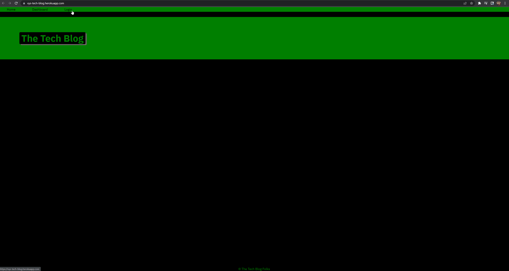

# tech-blog

## Description
This application is a freeflowing modern blog that allows users to start posts and then for other users to comment on those posts, essentially making each post a thread. Connection is vital in the modern digital world and sometimes we just need a quick and easy space to interact with other people. That is what blog is for. It is a straightforward blog/forum platform that allows users to simply post with minimal resistance - just register, log in and you're good to go! You can post, view posts, update, delete, edit and comment on other post. You also have a personal dashboard that shows all your own personal posts. All passwords are all salted, hashed and store securely using bcrypt.

## Table of Contents
* [Preview](#Preview)
* [Link](#Link)
* [Installation](#Installation)
* [Server Startup](#Server-Startup)
* [Packages](#Packages)
* [License](#License)
* [Contributing](#Contributing)
* [Questions](#Questions)

## Preview

## Link
[Tech Blog](https://vys-tech-blog.herokuapp.com/)

## Installation
* npm i
* mysql -u (db username) -p < db/schema.sql
* Change .env.Example file to .env and insert your db user and password

## Server Startup
* npm run watch

## Packages
* bycrypt
* connect-session-sequelize
* dotenv
* express
* express-handlebars
* express-session
* mysql2
* nodemon
* sequelize

## License

Copyright (c) [2022] [Vy Nguyen]

Permission is hereby granted, free of charge, to any person obtaining a copy of this software and associated documentation files (the "Software"), to deal in the Software without restriction, including without limitation the rights to use, copy, modify, merge, publish, distribute, sublicense, and/or sell copies of the Software, and to permit persons to whom the Software is furnished to do so, subject to the following conditions:

The above copyright notice and this permission notice shall be included in all copies or substantial portions of the Software.

THE SOFTWARE IS PROVIDED "AS IS", WITHOUT WARRANTY OF ANY KIND, EXPRESS OR IMPLIED, INCLUDING BUT NOT LIMITED TO THE WARRANTIES OF MERCHANTABILITY, FITNESS FOR A PARTICULAR PURPOSE AND NONINFRINGEMENT. IN NO EVENT SHALL THE AUTHORS OR COPYRIGHT HOLDERS BE LIABLE FOR ANY CLAIM, DAMAGES OR OTHER LIABILITY, WHETHER IN AN ACTION OF CONTRACT, TORT OR OTHERWISE, ARISING FROM, OUT OF OR IN CONNECTION WITH THE SOFTWARE OR THE USE OR OTHER DEALINGS IN THE SOFTWARE.

For more information, please visit: https://opensource.org/licenses/MIT

## Contributing
[Vy Nguyen](https://github.com/Vy187)

## Questions
If you have any questions about the repo, open an issue or contact me directly at vy1872@gmail.com